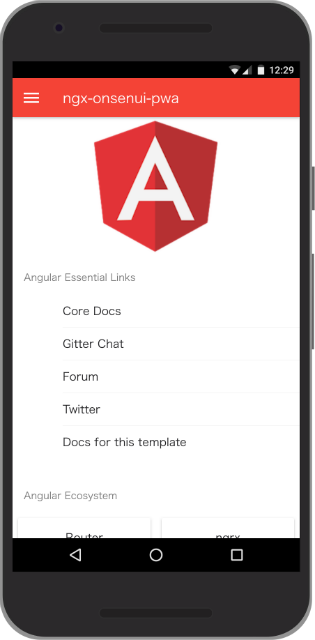

[![Build Status][travis-ci-image]][travis-ci-url]
[![Dependency status][david-dm-image]][david-dm-url]
[![Dev Dependency status][david-dm-dev-image]][david-dm-dev-url]
# ngx-onsenui-pwa



A Progressive Web App sample using `@angular/service-worker` and `ngx-onsenui`.

Try it here: [https://puku0x.github.io/ngx-onsenui-pwa/](https://puku0x.github.io/ngx-onsenui-pwa/).

## Prerequirements
- Node.js (v6 or later)
- Angular CLI

## How to run

```bash
$ npm install
$ ng serve
```

The app will run at [http://localhost:4200](http://localhost:4200).

## How to build

```
$ ng build --prod
```

## How to make a PWA with Angular CLI

1. Create a new project.

```
$ ng new <App Name>
```

2. Install `@angular/service-worker`.
```
$ npm install @angular/service-worker
```

3. Write your App.

4. Make a `manifest.json`. For example,
```
{
  "short_name": "Sample",
  "name": "Sample Application",
  "icons": [
    {
      "src": "icon-512x512.png",
      "sizes": "512x512",
      "type": "image/png"
    },
    {
      "src":"icon-144x144.png",
      "sizes": "144x144",
      "type": "image/png"
    }
  ],
  "start_url": "/index.html",
  "background_color": "#f24235",
  "theme_color": "#f44336",
  "display": "standalone"
}
```

5. Add a link to `manifest.json` in `index.html`
```
<link rel="manifest" href="manifest.json">
```

6. Add `manifest.json` to `assets` in `.angular-cli.json`.
```
{
  "apps": [
    {
      ...,
      "assets": [
        "assets",
        "favicon.ico",
        "manifest.json"
      ],
    }
  ]
}
```

7. Enable Service Worker in `.angular-cli.json`.
```
{
  "apps": [
    {
      ...,
      "serviceWorker": true,
    }
  ]
}
```

## Contributing

1. Fork it ( https://github.com/puku0x/ngx-onsenui-pwa/fork )
2. Create your feature branch (`git checkout -b my-new-feature`)
3. Commit your changes (`git commit -am 'Add some feature'`)
4. Push to the branch (`git push origin my-new-feature`)
5. Create new Pull Request


## References
- [Progressive Web Apps using the Angular Service Worker](https://bit.ly/pwa-angularsummit-2017) by @webmaxru
- [PWAs with the Angular](CLIhttps://medium.com/@amcdnl/service-worker-pwas-with-the-angular-cli-98a8f16d62d6) by @amcdn
- [Angular PWA](https://github.com/laco0416/c92-angular-pwa) by @laco0416

[travis-ci-url]: http://travis-ci.org/puku0x/ngx-onsenui-pwa
[travis-ci-image]: https://travis-ci.org/puku0x/ngx-onsenui-pwa.svg?branch=master
[david-dm-url]:https://david-dm.org/puku0x/ngx-onsenui-pwa
[david-dm-image]:https://david-dm.org/puku0x/ngx-onsenui-pwa.svg
[david-dm-dev-url]:https://david-dm.org/puku0x/ngx-onsenui-pwa?type=dev
[david-dm-dev-image]:https://david-dm.org/puku0x/ngx-onsenui-pwa/dev-status.svg
